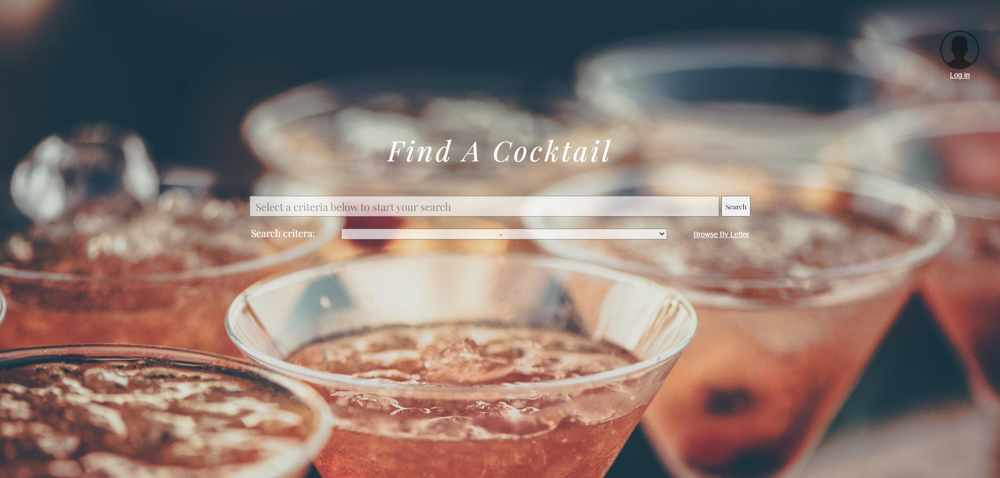
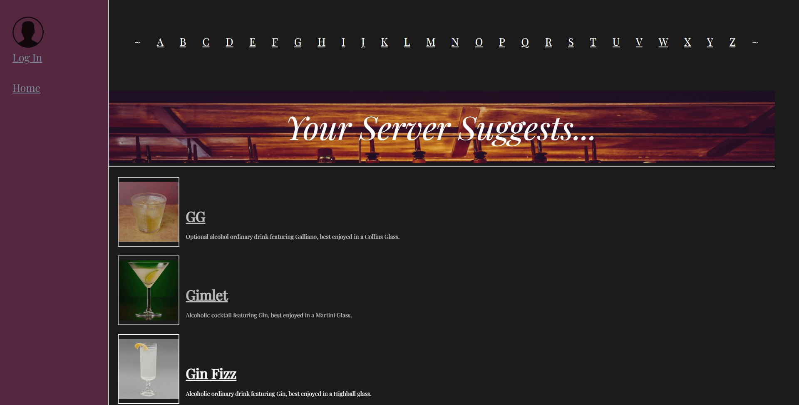

# Cocktail Finder by J.B.
Had a long week?  Treat yourself to a cool delicious craft cocktail for all of your hard work!  

You don't need to go to an expensive restaurant to get a expertly crafted cocktail anymore.  This app will walk you through all the steps and ingredients you need to create a tasty and memorable happy hour - right in the comfort of your own home.  

Found one you really like?  Log in with your [Google](https://google.com) account and add it to your favorites list so the recipe will be easily available on your next visit!

Enjoy! (responsibly)

## GETTING STARTED
---

[CLICK](https://cocktail-finder-by-jb.herokuapp.com/) to use the Cocktail Finder by J.B.

## SCREENSHOTS
---

## TECHNOLOGIES USED
---

- HTML5
- Cascading Style Sheets (CSS)
- Javascript
- Node.js
- Express
- MongoDb
- MongoDb Atlas
- Mongoose
- Google OAuth
- Passport
- DotEnv
- VS Code
- Heroku
- Github
- [pexels.com](https://pexels.com) (for stock images)
- [whimsical.com](https://whimsical.com) (for project planning)
- [trello.com](https://trello.com) (for project planning)

## NEXT STEPS
---

- Further polish styling
- Make sidebar collapsible
- Implement a "Want to Try" list feature
- Alphabetize results list
- Provide a list of available ingredients, to aid user search
- Links to needed materials for creating your own at-home bar
- Special Thanks Fine Print

## FROM PLANNING TO PRODUCTION
---

[Original Wireframe](https://whimsical.com/cocktail-finder-wireframe-S3zCjss3aN3hXGsvAwCiGx)

[Entity Relationship Diagram (ERD)](https://whimsical.com/cocktail-finder-erd-PVW4RejwMdHda3WoEgY8py)

[User Stories Pipeline](https://trello.com/b/YW3U20QO/user-stories-project-2)